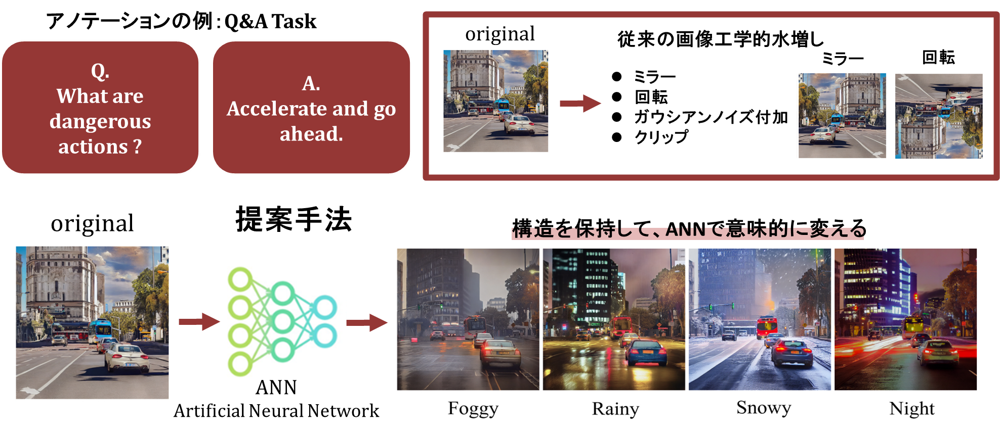
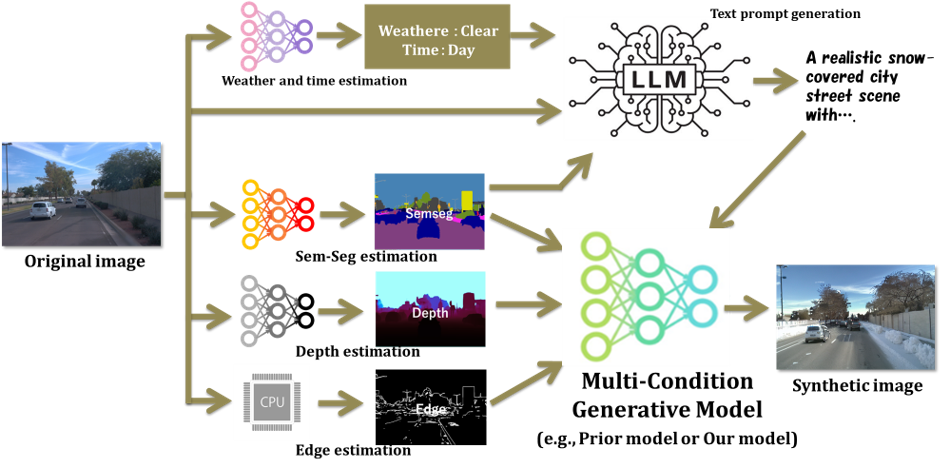
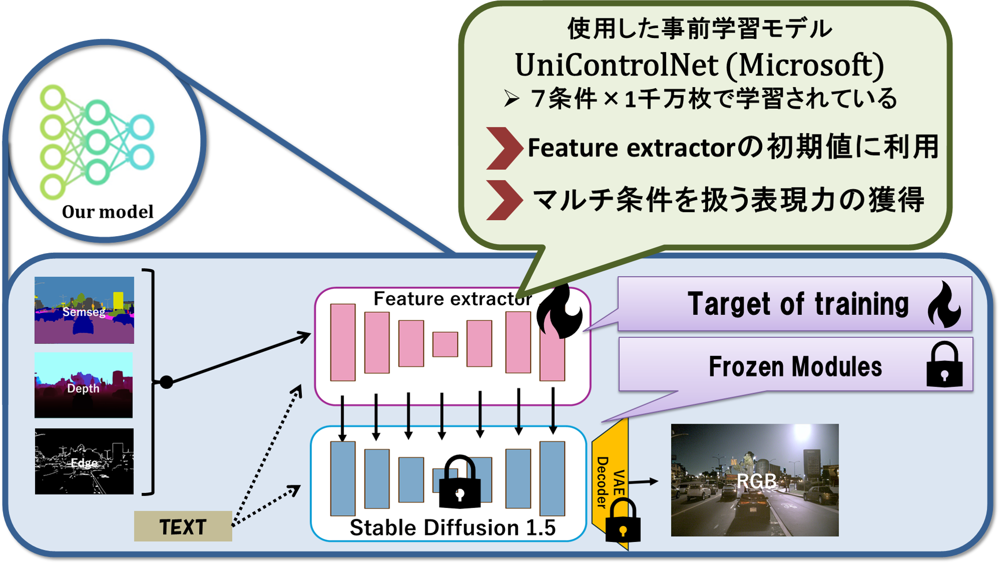
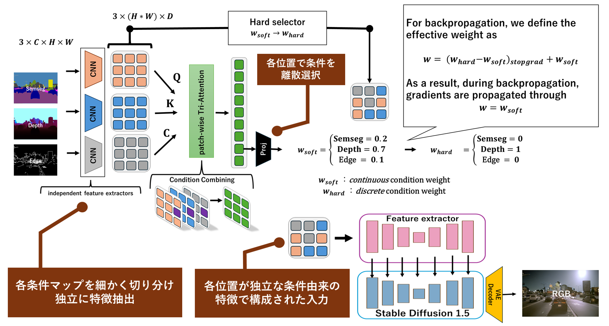
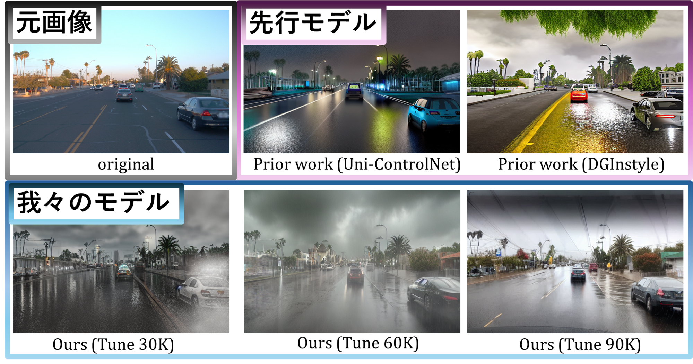
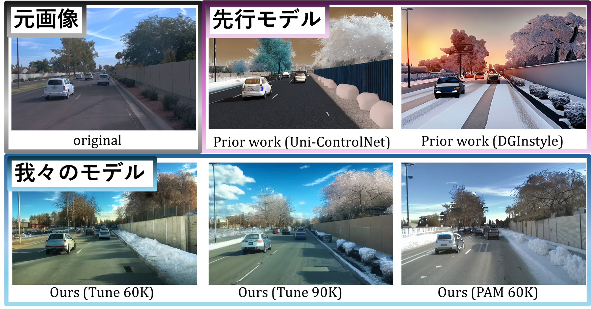

# AtteConDA: Attention-Based Conflict Suppression in Multi-Condition Diffusion Models and Synthetic Data Augmentation

[](#environment-setup)
[](#environment-setup)
[](#environment-setup)
[](#acknowledgements-and-upstream-dependencies)
[](https://shogonoguchi.github.io/AtteConDA/)
[](https://huggingface.co/collections/Shogo-Noguchi/atteconda)
[](./LICENSE)

AtteConDA is a reproducible **multi-condition diffusion framework for autonomous-driving synthetic data augmentation**.
It preserves scene structure with **semantic segmentation + depth + edge** conditions while explicitly suppressing inter-condition conflicts through **PAM (Patch-wise Adaptation Module)**.

This repository is designed to be useful in **two directions at the same time**:

1. **Public research release** for an English-first GitHub portfolio with clean documentation, model cards, and a project page.
2. **Research hand-off package** for future lab members so that the full flow  
   **train -> generate -> evaluate** can be reproduced from one repository.

> **Language note**
>
> The repository is now organized in English, but some original figure labels, comments, and filenames were created from the Japanese thesis draft and are still being translated.
> The public release keeps those assets for reproducibility first, then improves wording incrementally.

---

## 👨‍💻 ToDo

- ✅ Release the training code
- ✅ Release the inference code
- ✅ Release the model
- □ Release the arXiv paper

---

## Why AtteConDA?

Conventional image augmentation changes pixel statistics or geometry, but it usually cannot create **semantic weather/time-of-day changes** while keeping high-level road-scene structure intact.

AtteConDA is built around three ideas:

1. **Use multiple structural conditions at once**  
   semantic segmentation, depth, and edge are all injected into the generator.

2. **Reuse strong pretrained controllable diffusion representations**  
   the local control branch is initialized from Uni-ControlNet-compatible weights.

3. **Suppress condition conflicts explicitly**  
   PAM performs patch-wise condition selection so that low-frequency geometry and high-frequency contour constraints do not destroy each other.

---

## Project page

- **GitHub repository:** `https://github.com/ShogoNoguchi/AtteConDA`
- **Project page:** `https://shogonoguchi.github.io/AtteConDA/`
- **Hugging Face collection:** `https://huggingface.co/collections/Shogo-Noguchi/atteconda`

The Pages source is provided in [`docs/index.html`](./docs/index.html), and the deployment workflow is provided in [`.github/workflows/pages.yml`](./.github/workflows/pages.yml).

---

## Method overview

### 1) Why generative augmentation instead of only geometric augmentation?

<p align="center">
  
</p>

### 2) Full pipeline

<p align="center">
  
</p>

### 3) Model structure

<p align="center">
  
</p>

### 4) PAM: Patch-wise Adaptation Module

<p align="center">
  
</p>

---

## Result snapshot

### Qualitative examples

<p align="center">
  
</p>

<p align="center">
  
</p>

### Quantitative comparison against prior work

| Category | Metric | PAM60K | Tune60K | DGInStyle | Best among ours |
|---|---:|---:|---:|---:|---:|
| Semantic Segmentation | mIoU ↑ | 0.3310 | 0.3115 | 0.3722 | 0.3310 |
| Depth | RMSE ↓ | **27.77** | 33.02 | 36.71 | **27.77** |
| Edge | L1 Error ↓ | **0.04493** | 0.04561 | 0.09176 | **0.04493** |
| Object Preservation | F1 ↑ | **0.1071** | 0.0889 | 0.0790 | **0.1071** |
| Reality | CLIP-CMMD ↓ | 0.1794 | **0.1738** | 0.2710 | **0.1738** |
| Diversity | 1-MS-SSIM ↑ | 0.8480 | 0.8497 | **0.9240** | 0.8497 |
| Text Alignment | R-Precision@1 ↑ | 0.3258 | 0.3563 | **0.3606** | 0.3563 |

### What this means

AtteConDA is **not** trying to win only the easiest semantic-only score.
Its core target is **structure-preserving augmentation for high-level driving tasks**.
That is why depth consistency, edge consistency, object preservation, and realism are treated as first-class objectives.

---

## Released model zoo

All released checkpoints are listed in the public Hugging Face collection.

| Paper name | Hugging Face model | Link |
|---|---|---|
| FullScratch30K | AtteConDA-SDE-Scratch-30K | `https://huggingface.co/Shogo-Noguchi/AtteConDA-SDE-Scratch-30K` |
| Tune30K | AtteConDA-SDE-UniCon-30K | `https://huggingface.co/Shogo-Noguchi/AtteConDA-SDE-UniCon-30K` |
| Tune60K | AtteConDA-SDE-UniCon-60K | `https://huggingface.co/Shogo-Noguchi/AtteConDA-SDE-UniCon-60K` |
| Tune90K | AtteConDA-SDE-UniCon-90K | `https://huggingface.co/Shogo-Noguchi/AtteConDA-SDE-UniCon-90K` |
| PAM60K | AtteConDA-SDE-UniCon-60K-PAM | `https://huggingface.co/Shogo-Noguchi/AtteConDA-SDE-UniCon-60K-PAM` |
| Uni-ControlNet initialization checkpoint | AtteConDA-SDE-UniCon-Init | `https://huggingface.co/Shogo-Noguchi/AtteConDA-SDE-UniCon-Init` |

Model card templates for all six releases are provided under [`huggingface_model_cards/`](./huggingface_model_cards/).

---

## Repository layout

```text
AtteConDA/
├── README.md
├── LICENSE
├── THIRD_PARTY_NOTICES.md
├── CITATION.cff
├── docs/
│   ├── index.html
│   └── RESEARCHER_README.md
├── environment/
│   └── README.md
├── scripts/
│   └── verify_env.sh
├── prep/
│   ├── ucn_build_conditions.py
│   └── ucn_build_prompts.py
├── Uni-ControlNet/
│   ├── configs/
│   ├── src/train/train.py
│   └── src/tools/build_anno_syndiff_multi.py
├── DGInStyle/
├── eval/
│   └── ucn_eval/
└── figs/
```

For a researcher-oriented, dependency-aware explanation of the whole repository, see:

- [`docs/RESEARCHER_README.md`](./docs/RESEARCHER_README.md)

---

## Environment setup

This repository ships a reproducible environment description under `environment/`.

### Quick start

```bash
git clone https://github.com/ShogoNoguchi/AtteConDA.git
cd AtteConDA
conda env create -f environment/environment.yaml
conda activate atteconda_env
```

### Verification

```bash
bash scripts/verify_env.sh atteconda_env
```

### Important note about CUDA 12.8 and RTX 5090

This repository is intentionally aligned with **CUDA 12.8 / cu128** because the main training machine is an **RTX 5090**.
The currently shipped `environment/environment.yaml` is the author’s validated environment and therefore preserves the exact cu128 stack that was already used successfully on the lab machine.
See [`environment/README.md`](./environment/README.md) before replacing the PyTorch stack.

---

## Datasets

### Training datasets

| Dataset | Split / count |
|---|---|
| BDD10K (semantic subset) | train 7K / val 1K |
| Cityscapes | train 2975 / val 500 |
| GTA5 | 24,966 |
| nuImages (front) | 18,368 |
| BDD100K (excluding BDD10K overlap) | train 67K / val 10K / test 20K |

### Evaluation dataset

| Dataset | Split / count |
|---|---|
| Waymo front (first / mid10s / last extracted per segment) | train 2394 / val 606 / test 48 |

The evaluation pipeline uses Waymo RGB as the source image and compares original vs generated images in shared evaluation spaces.

---

## Step 1. Build condition maps

This stage generates **depth / edge / semantic segmentation** condition maps from RGB.

### 1-1. Build condition maps for training datasets

```bash
docker run --rm --gpus all \
  -e MPLBACKEND=Agg \
  -e MAIN_PY=/app/ucn_build_conditions.py \
  -e PIP_OVERLAY_DIR=/data/ucn_prep_cache/pip-overlay \
  -e REQS_OVERLAY_PATH=/data/ucn_prep_cache/requirements.overlay.txt \
  -e 'PIP_INSTALL=timm yacs huggingface_hub>=0.34,<1.0 einops' \
  -e PYTORCH_CUDA_ALLOC_CONF='expandable_segments:True,max_split_size_mb:128' \
  -v /home/shogo/coding/eval/ucn_eval/docker/entrypoint.sh:/app/entrypoint.sh:ro \
  -v /home/shogo/coding/prep/ucn_build_conditions.py:/app/ucn_build_conditions.py:ro \
  -v /home/shogo/coding/datasets:/home/shogo/coding/datasets:ro \
  -v /home/shogo/coding/Metric3D:/home/shogo/coding/Metric3D:ro \
  -v /home/shogo/.cache/huggingface:/root/.cache/huggingface \
  -v /data:/data \
  ucn-eval \
  --datasets all --tasks all --semseg-batch-size 1
```

### 1-2. Optional subset consistency check

```bash
docker run --rm --gpus all \
  -e MPLBACKEND=Agg \
  -e MAIN_PY=/app/ucn_build_conditions.py \
  -e PIP_OVERLAY_DIR=/data/ucn_prep_cache/pip-overlay \
  -e REQS_OVERLAY_PATH=/data/ucn_prep_cache/requirements.overlay.txt \
  -e 'PIP_INSTALL=timm yacs huggingface_hub>=0.34,<1.0 einops' \
  -e PYTORCH_CUDA_ALLOC_CONF='expandable_segments:True,max_split_size_mb:128' \
  -v /home/shogo/coding/eval/ucn_eval/docker/entrypoint.sh:/app/entrypoint.sh:ro \
  -v /home/shogo/coding/prep/ucn_build_conditions.py:/app/ucn_build_conditions.py:ro \
  -v /home/shogo/coding/datasets:/home/shogo/coding/datasets:ro \
  -v /home/shogo/coding/Metric3D:/home/shogo/coding/Metric3D:ro \
  -v /home/shogo/.cache/huggingface:/root/.cache/huggingface \
  -v /data:/data \
  ucn-eval \
  --datasets all --tasks all --subset-check --verbose
```

---

## Step 2. Build text prompts

This stage generates:

- **training prompts** for the source-domain training datasets
- **evaluation prompts** for Waymo

```bash
docker run --rm --gpus all \
  --entrypoint /app/entrypoint_prompts_v2.sh \
  -e MPLBACKEND=Agg \
  -e MAIN_PY=/app/ucn_build_prompts.py \
  -e PIP_OVERLAY_DIR=/data/ucn_prep_cache/pip-overlay \
  -e HF_HOME=/root/.cache/huggingface \
  -e OPENCLIP_CACHE_DIR=/root/.cache/huggingface/hub \
  -e VLM_LOCAL_DIR=/data/hf_models/Qwen/Qwen3-VL-32B-Instruct \
  -e QWEN_QUANT=4bit \
  -e TRANSFORMERS_OFFLINE=0 -e HF_HUB_OFFLINE=0 \
  -v /home/shogo/coding/eval/ucn_eval/docker/entrypoint_prompts_v2.sh:/app/entrypoint_prompts_v2.sh:ro \
  -v /home/shogo/coding/prep/ucn_build_prompts.py:/app/ucn_build_prompts.py:ro \
  -v /home/shogo/coding/datasets:/home/shogo/coding/datasets:ro \
  -v /home/shogo/.cache/huggingface:/root/.cache/huggingface \
  -v /data:/data \
  ucn-eval \
  --jobs train eval_waymo \
  --datasets all \
  --cityscapes-use-splits train \
  --bdd10k10k-use-splits train \
  --bdd100k-use-splits train \
  --vlm-local-dir /data/hf_models/Qwen/Qwen3-VL-32B-Instruct \
  --openclip-cache-dir /root/.cache/huggingface/hub \
  --quant 4bit \
  --clip-batch 8 \
  --cap-max-new 96 \
  --cap-words 45 \
  --hidethinking \
  --verbose
```

---

## Step 3. Build Uni-ControlNet annotation CSV files

After condition maps and prompts are ready, build the CSV files used by training and Waymo inference/evaluation.

```bash
cd /data/coding/B_thesis_Repo/Uni-ControlNet

python -u src/tools/build_anno_syndiff_multi.py \
  --make-train \
  --make-waymo-val \
  --limit -1 \
  --verbose
```

Expected outputs:

- `Uni-ControlNet/data/anno_syndiff_train.csv`
- `Uni-ControlNet/data/anno_syndiff_waymo_val.csv`

---

## Step 4. Training

### 4-1. Train without PAM

```bash
cd /data/coding/B_thesis_Repo/Uni-ControlNet

python -u src/train/train.py \
  --config-path ./configs/local_v15_syndiff.yaml \
  --learning-rate 1e-5 \
  --batch-size 4 \
  --training-steps 30084 \
  --resume-path /data/coding/Uni-ControlNet/ckpt/init_uni_EX7_fromSD15.ckpt \
  --logdir ./logs/finetune_uni_syndiff_EX7_FromNOPretrain_30Ksteps \
  --logger-version 7 \
  --log-freq 1000 \
  --ckpt-every-n-steps 30000 \
  --sd-locked True \
  --gpus 1
```

If you start from the released Uni-ControlNet-compatible initialization checkpoint, replace `--resume-path` with the path to `AtteConDA-SDE-UniCon-Init.ckpt`.
If you train fully from scratch, omit `--resume-path`.

### 4-2. Train with PAM

```bash
cd /data/coding/B_thesis_Repo/Uni-ControlNet

python -u src/train/train.py \
  --config-path ./configs/local_v15_syndiff_pam2.yaml \
  --learning-rate 1e-5 \
  --batch-size 4 \
  --training-steps 90168 \
  --resume-path /data/coding/ckpts/version_4/checkpoints/epoch=1-step=60000.ckpt \
  --logdir ./logs/finetune_uni_syndiff_pam2_From60KpurePretrain \
  --logger-version 0 \
  --log-freq 1000 \
  --ckpt-every-n-steps 30000 \
  --sd-locked True \
  --gpus 1
```

---

## Step 5. Waymo inference

### 5-1. Our model

```bash
python -u /data/coding/Uni-ControlNet/src/tools/infer_waymo_unicontrol_offline.py \
  --splits training validation testing \
  --camera front \
  --uni-config /data/coding/Uni-ControlNet/configs/uni_v15.yaml \
  --uni-ckpt /data/coding/Uni-ControlNet/logs/finetune_uni_syndiff_EX7_FromNOPretrain_30Ksteps/lightning_logs/version_7/checkpoints/periodic-stepstep=000030000.ckpt \
  --image-resolution 512 \
  --num-samples 1 \
  --ddim-steps 50 \
  --scale 7.5 \
  --strength 1.0 \
  --global-strength 0.0 \
  --prompt-root /data/syndiff_prompts/prompts_eval_waymo \
  --out-root /data/coding/datasets/WaymoV2/Ucn_byPure_Finetune30K_FromNOPretrain \
  --experiments-root /data/ucn_infer_cache_ex7 \
  --experiment-id EX7 \
  --experiment-note "Perform finetune 30Ksteps without using uni.ckpt, which is officially distributed by UniControlNet. Abration is used to measure the power of prior learning." \
  --overwrite \
  --verbose
```

Use the PAM config when running a PAM-trained checkpoint.
Use the non-PAM config when running a non-PAM checkpoint.

### 5-2. DGInStyle baseline

```bash
cd /data/coding/DGInStyle

python -u /data/coding/DGInStyle/src/tools/infer_waymo_unicontrol_offline.py \
  --splits training validation testing \
  --camera front \
  --DG-config /data/coding/DGInStyle/configs/dginstyle_sd15_semseg.yaml \
  --DG-ckpt yurujaja/DGInStyle \
  --image-resolution 512 \
  --num-samples 1 \
  --ddim-steps 50 \
  --scale 7.5 \
  --strength 1.0 \
  --eta 0.0 \
  --prompt-root /data/syndiff_prompts/prompts_eval_waymo \
  --out-root /data/coding/datasets/WaymoV2/DGInstyle_Pure \
  --experiments-root /data/ucn_infer_cache \
  --experiment-id EX9 \
  --experiment-note "DGInStyle + Qwen3-VL prompts" \
  --verbose
```

---

## Step 6. Evaluation

### 6-1. Build the evaluation Docker image

```bash
cd /home/shogo/coding/eval/ucn_eval

docker build \
  -t ucn-eval \
  -f /home/shogo/coding/eval/ucn_eval/docker/Dockerfile \
  /home/shogo/coding/eval/ucn_eval
```

### 6-2. Run evaluation

```bash
docker run --rm --gpus all \
  -e MPLBACKEND=Agg \
  -e PIP_OVERLAY_DIR=/data/ucn_eval_cache_ex9/pip-overlay \
  -e REQS_OVERLAY_PATH=/data/ucn_eval_cache_ex9/requirements.overlay.txt \
  -e 'PIP_INSTALL=timm yacs prefetch_generator easydict thop scikit-image pytesseract huggingface_hub>=0.34,<1.0 einops matplotlib lpips pytorch-msssim' \
  -v /home/shogo/coding/eval/ucn_eval/docker/entrypoint.sh:/app/entrypoint.sh:ro \
  -v /home/shogo/coding/eval/ucn_eval/eval_unicontrol_waymo.py:/app/eval_unicontrol_waymo.py:ro \
  -v /home/shogo/coding/datasets/WaymoV2:/home/shogo/coding/datasets/WaymoV2:ro \
  -v /home/shogo/coding/Metric3D:/home/shogo/coding/Metric3D:ro \
  -v /data:/data \
  -v /home/shogo/.cache/huggingface:/root/.cache/huggingface \
  -v /data/ucn_eval_cache_ex9/torch_hub:/root/.cache/torch/hub \
  ucn-eval \
  --cache-root /data/ucn_eval_cache_ex9 \
  --splits training validation testing \
  --camera front \
  --tasks all \
  --reality-metric clip-cmmd \
  --gdinomodel IDEA-Research/grounding-dino-base \
  --det-prompts car truck bus motorcycle bicycle person pedestrian "traffic light" "traffic sign" "stop sign" "speed limit sign" "crosswalk sign" "construction sign" "traffic cone" \
  --ocr-engine tesseract \
  --iou-thr 0.5 \
  --orig-root /home/shogo/coding/datasets/WaymoV2/extracted \
  --gen-root /data/coding/datasets/WaymoV2/DGInstyle_Pure \
  --prompt-root /data/syndiff_prompts/prompts_eval_waymo \
  --annotation-mode all \
  --annotate-limit 24 \
  --annotate-out /data/ucn_eval_cache_ex9/viz_ex9 \
  --tb --tb-dir /data/ucn_eval_cache_ex9/tensorboard_ex9 \
  --experiment-id EX9 \
  --experiment-note "DGInStyle + Qwen3-VL prompts" \
  --drivable-methods onefroad \
  --no-auto-batch \
  --verbose
```

---

## TensorBoard

Training and evaluation both support TensorBoard logging.

Typical example:

```bash
tensorboard --logdir /data/ucn_eval_cache_ex9/tensorboard_ex9 --bind_all
```

---

## Researcher hand-off document

For the full lab-facing explanation, including:

- dataset trees
- dependency trees
- exact absolute paths
- public-vs-vendored provenance
- external runtime model download sources
- cleanup recommendations
- release checklist

see:

- [`docs/RESEARCHER_README.md`](./docs/RESEARCHER_README.md)

---

## Acknowledgements and upstream dependencies

AtteConDA stands on top of several important upstream projects.

### Directly relevant upstream codebases

- **Uni-ControlNet**  
  all-in-one controllable diffusion backbone used as the main architectural starting point  
  repository: `https://github.com/ShihaoZhaoZSH/Uni-ControlNet`

- **DGInStyle**  
  important prior work and baseline for autonomous-driving diffusion-based augmentation  
  repository: `https://github.com/prs-eth/DGInStyle`

## Academic context

This repository was implemented and organized by Shogo Noguchi.

This work was conducted as bachelor’s thesis research in Yuminaka Lab, Gunma University, under the academic supervision of Prof. Yasushi Yuminaka.

### Paper-level inspiration

- **PixelPonder**  
  cited as a research idea reference for dynamic multi-condition conflict handling  
  paper: `https://arxiv.org/abs/2503.06684`

This repository acknowledges the paper as prior art, but does **not** claim code provenance from an unlicensed source tree.

### Runtime-downloaded models and tools

- Stable Diffusion v1.5 family
- OneFormer (Cityscapes)
- Metric3Dv2
- Grounding DINO
- CLIP / open_clip
- Qwen3-VL
- LPIPS / AlexNet
- Tesseract OCR

See [`THIRD_PARTY_NOTICES.md`](./THIRD_PARTY_NOTICES.md) and [`docs/RESEARCHER_README.md`](./docs/RESEARCHER_README.md) for detailed attribution and release guidance.

---

## License

- **AtteConDA-original top-level documentation and release assets in this bundle:** Apache-2.0  
- **Vendored / modified upstream code:** keep each upstream license inside its own subtree  
- **Model weights:** follow the model card and upstream base-model terms

Please read:

- [`LICENSE`](./LICENSE)
- [`THIRD_PARTY_NOTICES.md`](./THIRD_PARTY_NOTICES.md)

before redistributing code or checkpoints.

---

## Citation

A software citation file is provided as [`CITATION.cff`](./CITATION.cff).

BibTeX-style software citation:

```bibtex
@misc{noguchi2026atteconda,
  title        = {AtteConDA: Attention-Based Conflict Suppression in Multi-Condition Diffusion Models and Synthetic Data Augmentation},
  author       = {Shogo Noguchi},
  year         = {2026},
  howpublished = {GitHub repository},
  note         = {Gunma University}
}
```
