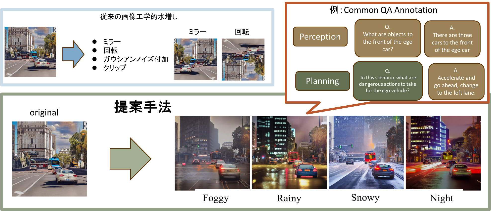
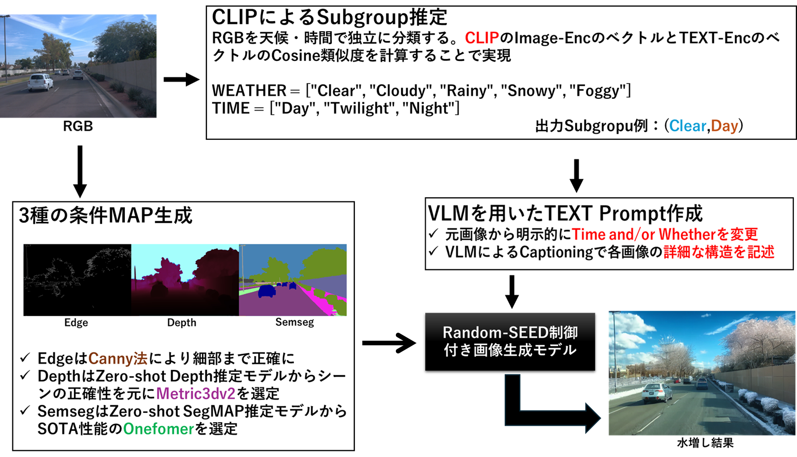
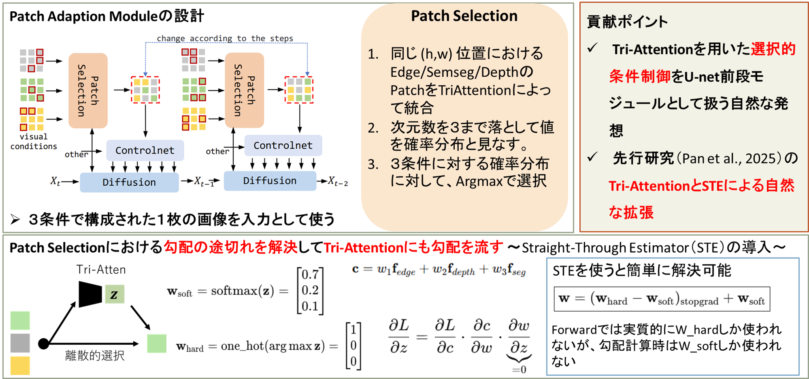
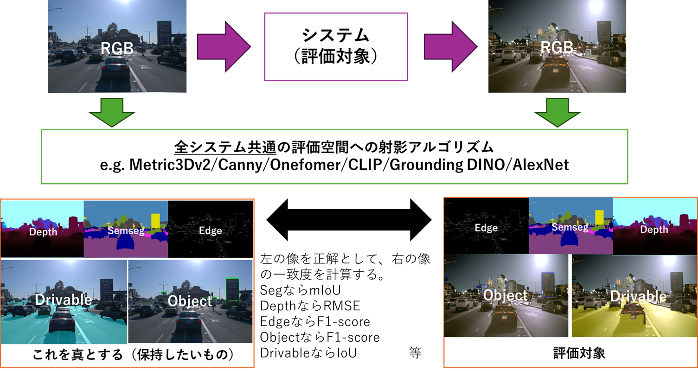
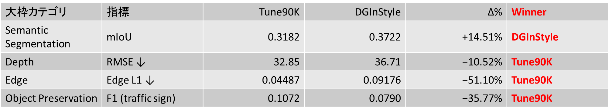
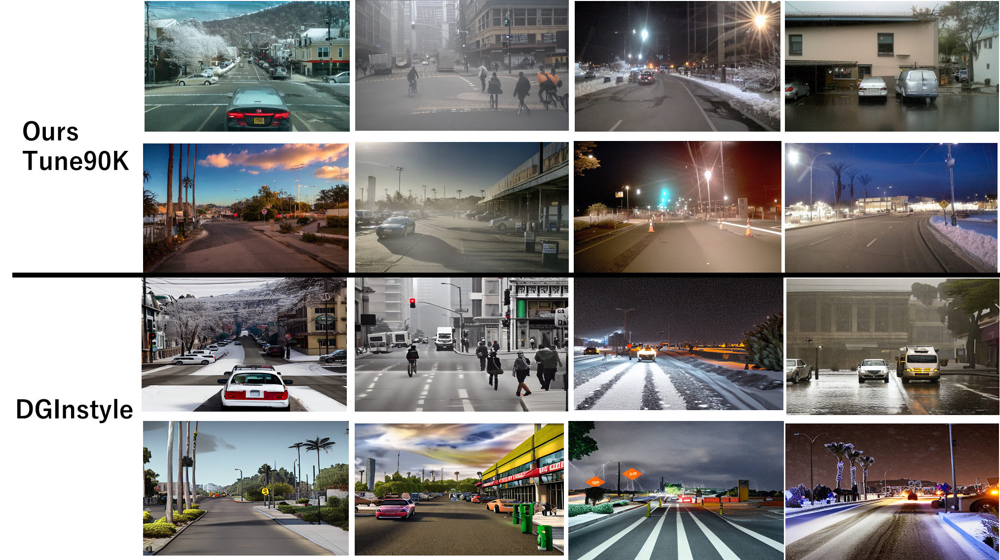

# A Unified Framework for Geometry-Consistent Synthetic Data Augmentation



This repository contains the official implementation and evaluation pipeline for my **Bachelor’s Thesis**,  
which studies **geometry-consistent synthetic data augmentation for autonomous driving** using **Uni-ControlNet**.

The core objective is to **augment driving images while strictly preserving geometric and semantic annotations**,  
and to **quantitatively evaluate hallucination, realism, and structural consistency** in a unified manner.

---

## 🔍 Key Contributions

- A **geometry-consistent augmentation framework** based on Uni-ControlNet  
- A **fully automated train → inference → evaluation pipeline**
- **Multi-axis quantitative evaluation** covering:
  - Realism
  - Structural fidelity
  - Object preservation & hallucination
  - Drivable area consistency
  - Diversity and augmentation strength
- **WaymoV2-based large-scale evaluation**

---

## 🧠 Method



Given an original driving image **X** with annotations, we generate an augmented image **F(X)** such that:

- Geometry (lanes, roads, object layout) is preserved
- Appearance (weather, time, illumination, style) is diversified
- Annotations remain valid without manual relabeling

The framework builds on **Uni-ControlNet**, extending it with:
- Prompt-controlled appearance changes
- Geometry-locked conditioning
- Evaluation-aware experiment management

---

## 🖼 Qualitative Results



The generated images demonstrate:
- Strong appearance diversity
- Preservation of road structure and objects
- Absence of obvious geometric hallucination

---

## 📊 Evaluation Pipeline



We evaluate augmented data **X vs F(X)** using a unified evaluation suite that measures:

- **Reality**: CLIP-CMMD / CLIP-FID  
- **Structure**: Edge / Depth / Semantic Segmentation  
- **Objects**: Grounding-DINO based preservation & hallucination metrics  
- **Drivable Area**: YOLOP / OneFormer-based road consistency  
- **Diversity**: LPIPS, 1 − MS-SSIM  

All metrics are computed **without human intervention**.

---

## 📈 Main Results



> **This table corresponds to the primary quantitative results of the thesis.**

Key findings:
- Geometry-consistent augmentation significantly improves data diversity
- Structural degradation and hallucination are quantitatively suppressed
- Drivable-area consistency is maintained across all splits

---

## 🔬 Comparison with Existing Methods



Compared with existing diffusion-based augmentation approaches:
- Our method achieves **lower hallucination**
- Better **structural and semantic consistency**
- Comparable or superior visual diversity

---

## ⚙ Setup

### Environment
- Ubuntu (GPU required)
- CUDA **12.8**
- PyTorch (CUDA-enabled)

> **CPU-only execution is not supported.**

---

## ☕ Training

Example (EX8: PAM2 fine-tuning from Uni checkpoint):

```bash
bash eval/ucn_eval/EX8_train_infer_eval_wait.sh
This script performs the following steps **in a fully automated and collision-safe manner**:

1. **Training**  
   Fine-tunes Uni-ControlNet (PAM2) from a pretrained Uni checkpoint.

2. **Inference**  
   Generates augmented images for WaymoV2 using offline inference.

3. **Evaluation**  
   Runs the Docker-based `ucn-eval` pipeline to compute all metrics:
   realism, structure, object preservation, drivable area consistency,
   and diversity.
